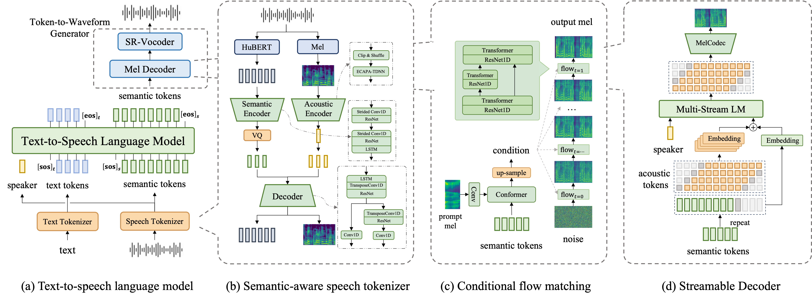

<div align="center">

<p align="center">
  
</p>

<h1>FireRedTTS: A Foundation Text-To-Speech Framework for Industry-Level Generative Speech Applications</h1>

<p align="center">
  
</p>
</div>

#### 👉🏻 [FireRedTTS Paper](https://arxiv.org/abs/2409.03283) 👈🏻

#### 👉🏻 [FireRedTTS Demos](https://fireredteam.github.io/demos/firered_tts/) 👈🏻

## News

- **[2024/09/20] 🔥 We release the pre-trained checkpoints and inference code.**
- [2024/09/06] 🔥 We release the [technical report](https://arxiv.org/abs/2409.03283) and [project page](https://fireredteam.github.io/demos/firered_tts/)

## Roadmap

- [ ] 2024/09
  - [x] Release the pre-trained checkpoints and inference code.
  - [ ] Release testing set.

- [ ] 2024/10
  - [ ] Release rich punctuation version.
  - [ ] Release finetuned checkpoints for controllable human-like speech generation.

## Usage

#### Clone and install

- Clone the repo

```shell
https://github.com/FireRedTeam/FireRedTTS.git
cd FireRedTTS
```

- Create conda env

```shell
# step1.create env
conda create --name redtts python=3.10

# stpe2.install torch （pytorch should match the cuda-version on your machine）
# CUDA 11.8
conda install pytorch==2.3.1 torchvision==0.18.1 torchaudio==2.3.1 pytorch-cuda=11.8 -c pytorch -c nvidia
# CUDA 12.1
conda install pytorch==2.3.1 torchvision==0.18.1 torchaudio==2.3.1 pytorch-cuda=12.1 -c pytorch -c nvidia

# step3.install fireredtts form source
pip install -e . 

# step4.install other requirements
pip install -r requirements.txt
```

#### Download models

Download the required model files from [**Model_Lists**](https://huggingface.co/fireredteam/FireRedTTS/tree/main) and place them in the folder `pretrained_models`

#### Basic Usage

```python
import os
import torchaudio
from fireredtts.fireredtts import FireRedTTS

tts = FireRedTTS(
    config_path="configs/config_24k.json",
    pretrained_path=<pretrained_models_dir>,
)

#same language
rec_wavs = tts.synthesize(
        prompt_wav="examples/prompt_1.wav",
        text="小红书，是中国大陆的网络购物和社交平台，成立于二零一三年六月。",
        lang="zh",
)

rec_wavs = rec_wavs.detach().cpu()
out_wav_path = os.path.join("./example.wav")
torchaudio.save(out_wav_path, rec_wavs, 24000)

```

## Tips

- Removing the long silence (>1s) in the middle of prompt_wav may bring better stability. If there are too many long silences in your prompt_wav and it causes stability problems, it is recommended to use our tool(`tools/process_prompts.py`) to remove the silence.

## Acknowledgements

- [**Tortoise-tts**](https://github.com/neonbjb/tortoise-tts) and [**XTTS-v2**](https://github.com/coqui-ai/TTS) offer invaluable insights for constructing an autoregressive-style system.
- [**Matcha-TTS**](https://github.com/shivammehta25/Matcha-TTS) and [**CosyVoice**](https://github.com/FunAudioLLM/CosyVoice) demonstrate the excellent ability of flow-matching in converting audio code to mel.
  
- [**BigVGAN-v2**](https://github.com/NVIDIA/BigVGAN), utilized for vocoding.
- We referred to [**whisper’s**](https://github.com/openai/whisper) text tokenizer solution.
