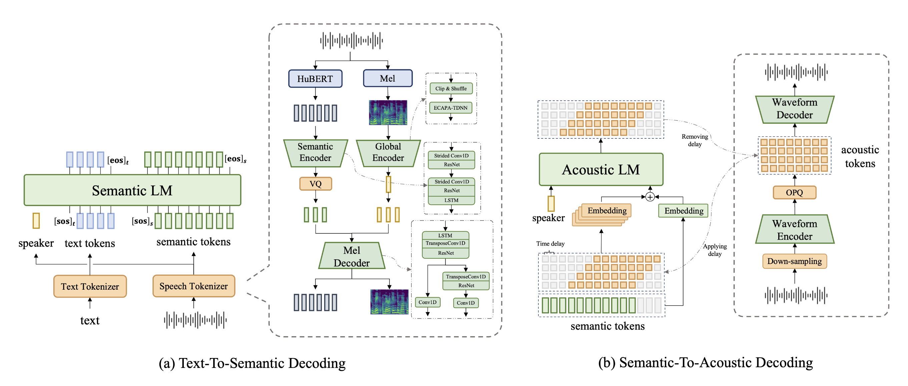

<div align="center">

<p align="center">
  
</p>

<h1>FireRedTTS-1S: An Upgraded Streamable Foundation
Text-to-Speech System</h1>

<p align="center">
  
</p>
</div>

#### 👉🏻 [FireRedTTS-1S Paper](https://arxiv.org/abs/2503.20499) 👈🏻

#### 👉🏻 [FireRedTTS-1S Demos](https://fireredteam.github.io/demos/firered_tts_1s/) 👈🏻

##### ⚠️ Note: The current branch is `FireRedtts-1s`. To access `FireRedtts-1`, please switch to the `FireRedtts-1` branch

## News

- [2025/05/26] 🔥 We add flow-mathing decoder and update the [technical report](https://arxiv.org/abs/2503.20499)
- [2025/03/25] 🔥 We release the [technical report](https://arxiv.org/abs/2503.20499) and [project page](https://fireredteam.github.io/demos/firered_tts_1s/)

## Roadmap

- [x] 2025/04
  - [x] Release the pre-trained checkpoints and inference code.
  
## Usage

#### Clone and install

- Clone the repo

```shell
https://github.com/FireRedTeam/FireRedTTS.git
cd FireRedTTS
```

- Create conda env

```shell
# step1.create env
conda create --name redtts python=3.10

# stpe2.install torch （pytorch should match the cuda-version on your machine）
# CUDA 11.8
conda install pytorch==2.3.1 torchvision==0.18.1 torchaudio==2.3.1 pytorch-cuda=11.8 -c pytorch -c nvidia
# CUDA 12.1
conda install pytorch==2.3.1 torchvision==0.18.1 torchaudio==2.3.1 pytorch-cuda=12.1 -c pytorch -c nvidia

# step3.install fireredtts form source
cd fireredtts
pip install -e . 

# step4.install other requirements
pip install -r requirements.txt
```

#### Download models

Download the required model files from [**Model_Lists**](https://huggingface.co/FireRedTeam/FireRedTTS-1S/tree/main) and place them in the folder `pretrained_models`

#### Basic Usage

```python
import os
import torchaudio
from fireredtts.fireredtts import FireRedTTS

# acoustic llm decoder
tts = FireRedTTS(
        config_path="configs/config_24k.json",
        pretrained_path=<pretrained_models_dir>,
  )


"""
# flow matching decoder
tts = FireRedTTS(
        config_path="configs/config_24k_flow.json",
        pretrained_path=<pretrained_models_dir>,
)
"""

#same language
# For the test-hard evaluation, we enabled the use_tn=True configuration setting.
rec_wavs = tts.synthesize(
  prompt_wav="examples/prompt_1.wav",
  prompt_text="对，所以说你现在的话，这个账单的话，你既然说能处理，那你就想办法处理掉。",
  text="小红书，是中国大陆的网络购物和社交平台，成立于二零一三年六月。",
  lang="zh",
  use_tn=True
)


rec_wavs = rec_wavs.detach().cpu()
out_wav_path = os.path.join("./example.wav")
torchaudio.save(out_wav_path, rec_wavs, 24000)

```

## Tips

- The reference audio should not be too long or too short; a duration of 3 to 10 seconds is recommended.
- The reference audio should be smooth and natural, and the accompanying text must be accurate to enhance the stability and naturalness of the synthesized audio.

## Acknowledgements

- [**Tortoise-tts**](https://github.com/neonbjb/tortoise-tts) and [**XTTS-v2**](https://github.com/coqui-ai/TTS) offer invaluable insights for constructing an autoregressive-style system.

- We referred to [**fish-speech**](https://github.com/fishaudio/fish-speech) text tokenizer solution.

- We referred to [**BigCodec**](https://github.com/Aria-K-Alethia/BigCodec) speech codec solution.

- We referred to [**Encodec**](https://github.com/facebookresearch/encodec) causal convolution solution.

- We referred to [**SpeechBrain**](https://github.com/speechbrain/speechbrain) ECAPA-TDNN solution.

- We referred to [**ChineseSpeechPretrain**](https://github.com/TencentGameMate/chinese_speech_pretrain) HuBERT model.

## ⚠️ Usage Disclaimer ❗️❗️❗️❗️❗️❗️

- The project incorporates zero-shot voice cloning functionality; Please note that this capability is intended **solely for academic research purposes**.
- **DO NOT** use this model for **ANY illegal activities**❗️❗️❗️❗️❗️❗️
- The developers assume no liability for any misuse of this model.
- If you identify any instances of **abuse**, **misuse**, or **fraudulent** activities related to this project, **please report them to our team immediately.**
